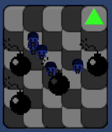

# RetoMultiAgentes

## Integrantes 
- Jorge Emiliano Pomar Mendoza - A01709338
- Arturo Sánchez Rodríguez - A01275427
- Jesus Ramirez Delgado - A01274723


## Para iniciar el servidor en la terminal
```bash
python server.py
```

## Para cargar la escena en Unity y correr la simulación

1. Abrir Unity

2. En el menu superior ir a File -> Open Scene y seleccionar carpeta de Scenes y abrir el archivo  "EscenaGrid.unity".

3. En la parte superior izquierda de la pantalla de Unity, dar clic en el boton de Play para iniciar la simulación.


## Para cerrar la simulación
1. En la parte superior izquierda de la pantalla de Unity, dar clic en el boton de Play para detener la simulación.

2. Ir a la terminal y presionar Ctrl + C para detener el servidor.